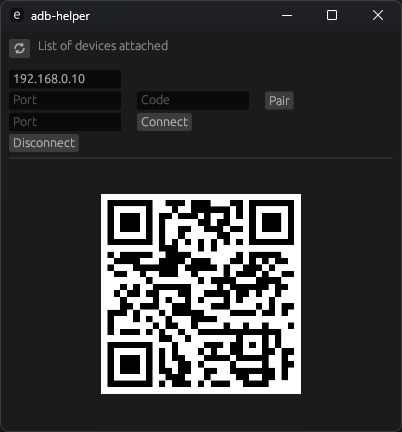

# adb_helper
adb_helper provides an easy way to connect your android phone for wireless debugging via pairing code or qr-code.  

## Usage
If you want to conect your phone with code, then select appropriate option in your phone and:
1. fill IP, Port and Code fields;
2. click Pair;
3. after succesfull pairing enter new Port, which you should see on your android device;
4. click Connect;
5. done!
## Be aware
As I made this helper mostly for myself, it has two main limitations:
* adb should be accessible in PATH (adb executable can be located in `/platform-tools` folder of Android SDK)
* multiple devices should work (this was not tested), but Disconect button will disconnect first or last device from the list on top